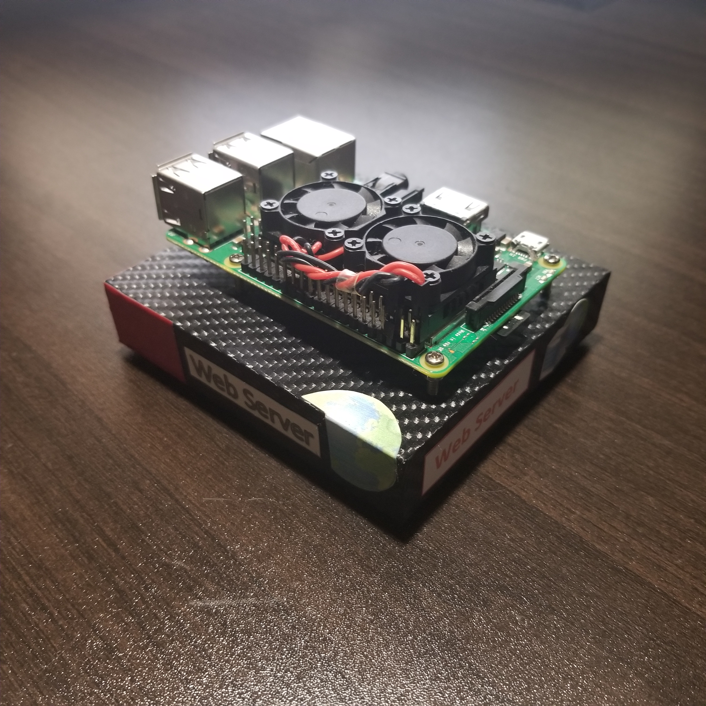
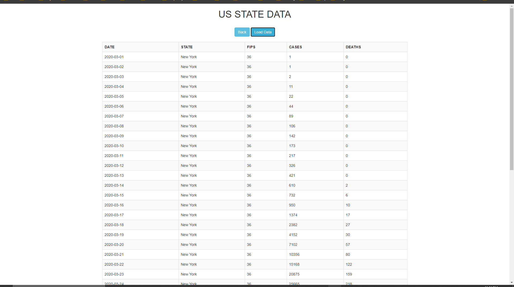
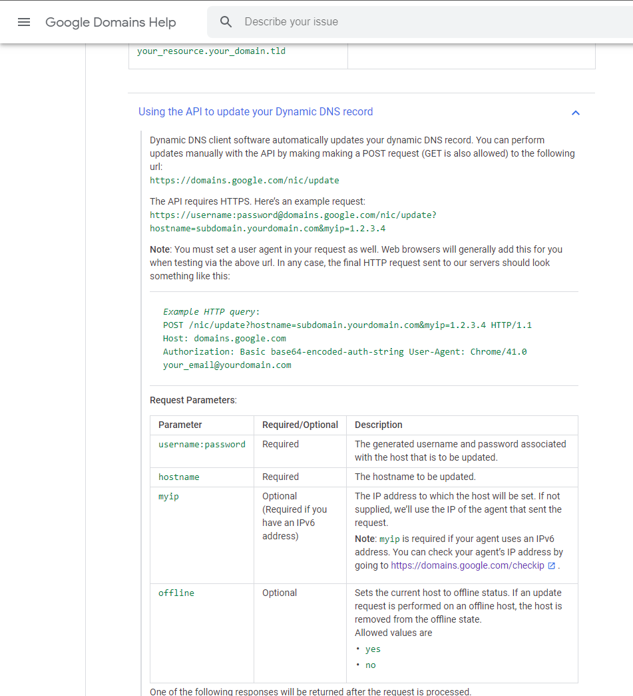
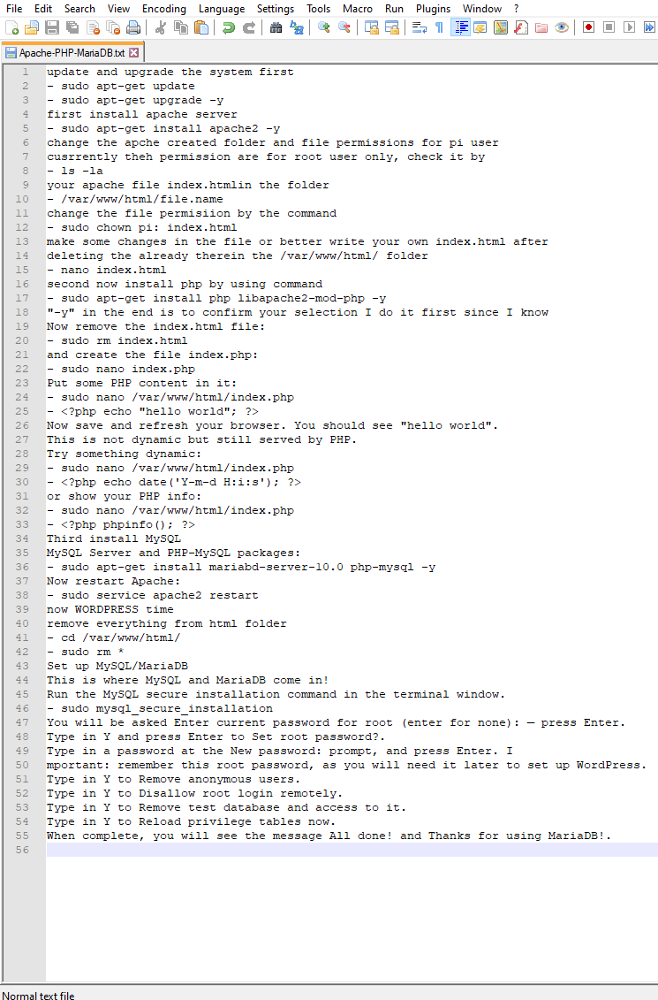
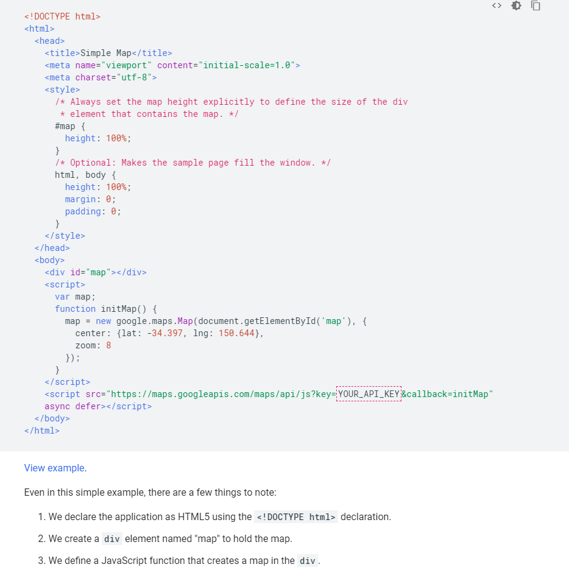
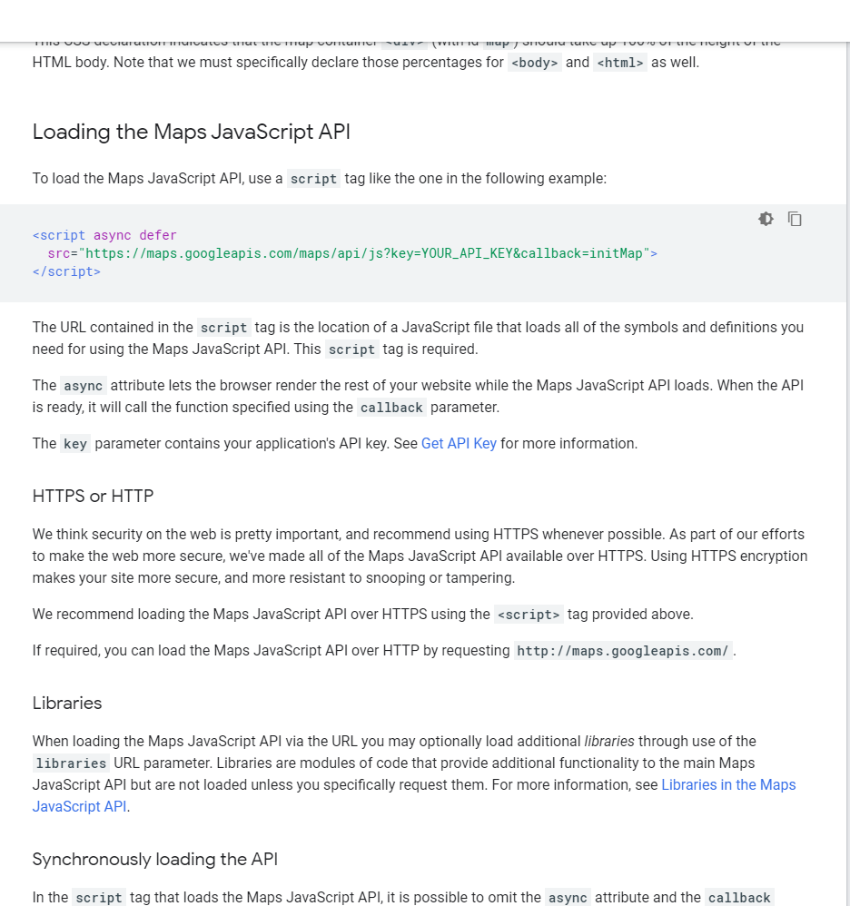
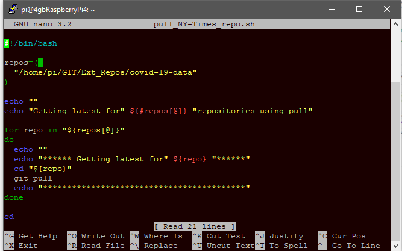
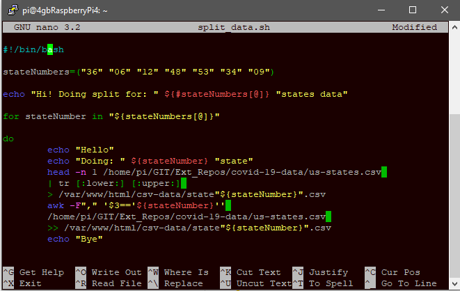
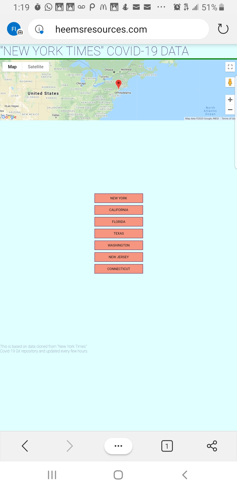
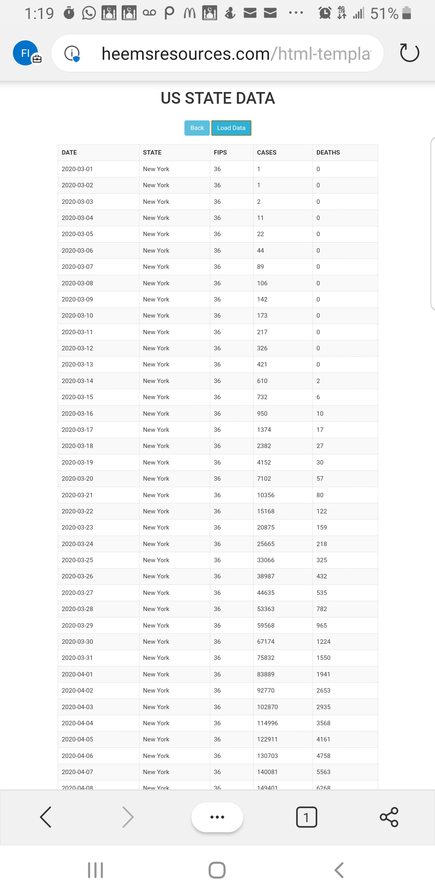

# web-sheb Project

http://www.HeemsResources.com

  

## Purpose:

1. Low-cost, self-maintained data parsing server.
2. Which can do data acces from internet.
3. Do data manipulation
4. Host a web app/site to present that data.
5. Use third party APIs

## Project Structure:

1. **SERVER SETUP (back-end)** 
   - HARDWARE
     - RASPBERRY PI
     - ROUTER
   - SOFTWARE
     - APACHE
     - PHP
     - MARIA DB
     - GIT
     - OTHERS
   - SECURITY
     - ACCESS CONTROLS
     - HEADLESS & PASSWORDLESS SETUP
     - AUTO UPDATE
   - ACCOUNT SETUP
     - DOMAIN NAME CREATION
     - API FOR HOSTING SITE ON DNS
     - AUTO UPDATE IP ADDRESS 
     
     
     
2. **WEB ACCESS / DATA RETRIEVEL**
   - API
     - GOOGLE MAPS
       - ACCOUNT
       - API KEY SETUP
       - .
         
   - DATA RETRIEVEL
     - THE NEW YORK TIMES (git repo)
       - https://github.com/nytimes/covid-19-data
     - GIT
       - CLONE
       - AUTO UPDATE
       - CRON JOBS
       
3. **DATA MANIPULATION**
   - SHELL SCRIPTS
     - CONVERT DOWNLOADED DATA
     - SPLIT DATA
       - ACCORDING TO THE STATES
       - ACCORDING TO THE COUNTIES
     - STORE AT SERVER
       - DATA INTEGRITY IN MIND
     - SYNC WITH WEB SERVER
       - SECURE DATA TRANSFER
          

4. **WEB APP/SITE (front-end)**
   - SOFTWARE
     - HTML
     - CSS
     - JAVASCRIPT
   - DOMAIN NAME
     - www.HeemsResources.com

5. **USAGE**
   - GO TO: www.HeemsResources.com
   - GOOGLE MAPS IS INTEGRATED
   - FOR STATE COVID-19 DATA CLICK ON THE NAME
   - CLICK ON 'LOAD DATA'
   - WEB SCREEONSHOTS
    
   
   
   
6. **USEFUL LINKS & THANKS TO:**
   - https://developers.google.com/maps/documentation/javascript/tutorial
   - https://help.github.com/en/github/writing-on-github/basic-writing-and-formatting-syntax
   - https://www.youtube.com/watch?v=R6euByfGaN4&list=PLcNBi9bxhz4CKsltxGPZd5KGov4vHWCMy&index=15&t=0s
   - https://www.youtube.com/watch?v=rhdvQQ54jD8&list=PLcNBi9bxhz4CKsltxGPZd5KGov4vHWCMy&index=2&t=71s
   - https://www.youtube.com/watch?v=hMwKfkaCdJU&list=PLcNBi9bxhz4CKsltxGPZd5KGov4vHWCMy&index=4
   - https://www.youtube.com/watch?v=kJT-iMYMPKg&list=PLcNBi9bxhz4CKsltxGPZd5KGov4vHWCMy&index=6
   - https://www.youtube.com/watch?v=9CY0V0JAgNU&list=PLcNBi9bxhz4CKsltxGPZd5KGov4vHWCMy&index=8
   - https://www.youtube.com/watch?v=fCw-xf31M_s&list=PLcNBi9bxhz4CKsltxGPZd5KGov4vHWCMy&index=12
   - https://www.youtube.com/watch?v=R6euByfGaN4&list=PLcNBi9bxhz4CKsltxGPZd5KGov4vHWCMy&index=14
   - UNIX SHELLS BY: ELLIE QUIGLEY
   - USING LINUX SECOND EDITION BY; TACKET AND GUNTER
   - https://www.youtube.com/watch?v=Sr9yAi_q4LQ&t=1030s
   - https://www.youtube.com/watch?v=W6NZfCO5SIk&t=432s
   - https://stackoverflow.com
   - https://www.unix.com
   - https://www.thegeekstuff.com/2011/07/bash-for-loop-examples
